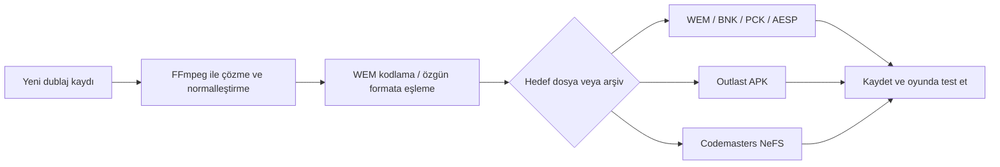
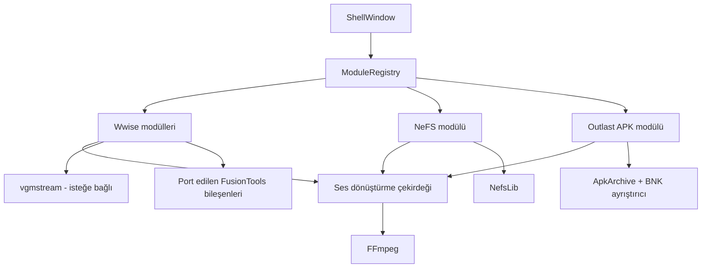

# UDMT — Universal Dubbing Modding Tool

**UDMT**, Wwise tabanlı oyunlara yönelik dublaj modları hazırlamak için geliştirilen, modüler bir Windows masaüstü aracıdır. Uygulamanın temel amacı; yeni ses kayıtlarını oyunun beklediği teknik biçime dönüştürmek, özgün ses dosyalarını bulmak, değiştirmek ve oyun arşivini yeniden paketlemek için gereken dağınık işlemleri tek arayüzde toplamaktır.

> **Geliştirme durumu:** Erken geliştirme / `0.1.0`  
> **Platform:** Windows  
> **Teknoloji:** C# · .NET 9 · WPF/XAML  
> **Dil hedefi:** Uygulama, belgeler, commit mesajları, issue’lar ve pull request’ler Türkçe olmalıdır.

> [!IMPORTANT]
> Bu README, teslim edilen kaynak arşivinin tamamı incelenerek hazırlanmıştır. GitHub deposuna tam dosya aktarımı henüz tamamlanmadığı için depodaki mevcut hâl tek başına derlenebilir değildir. Eksiksiz aktarım [Issue #1](https://github.com/apexlions16/UDMT/issues/1) kapsamında takip edilmektedir.

## UDMT tam olarak ne işe yarar?

Bir oyunun konuşma sesini değiştirmek çoğu zaman yalnızca yeni bir WAV dosyasını kopyalamaktan ibaret değildir. Kaydın:

- oyunda kullanılan Wwise sürümüne,
- codec türüne,
- örnekleme hızına,
- kanal sayısına,
- ses bankasındaki kimliğine,
- CUE ve etiket gibi zamanlama verilerine,
- oyunun kullandığı üst arşiv biçimine

uygun olması gerekir.

UDMT bu zinciri tek uygulamada birleştirmeyi hedefler:



Bu nedenle UDMT, yalnızca bir “ses dönüştürücü” değil; **dublaj sesini hazırlama, inceleme, eşleştirme, arşive yerleştirme ve yeniden paketleme aracı**dır.

## Hedeflenen kullanım alanları

### 1. Genel Wwise dosyaları

Dosya biçimi ve Wwise sürümü uyumlu olduğu sürece farklı oyunlardan alınan aşağıdaki dosyalar üzerinde çalışmayı hedefler:

- `.wem` — Wwise ses dosyası
- `.bnk` — Wwise ses bankası
- `.pck` — Wwise paket dosyası
- `.aesp` — Audio Event System Package

### 2. Outlast ve Whistleblower

Uygulamada bu oyunlar için özel bir modül vardır. Buradaki `.apk`, Android uygulama paketi değildir; BNK ses bankalarını taşıyan oyuna özel bir arşivdir.

Outlast modülü:

- `.apk` arşivini açabilir ve yeniden paketleyebilir,
- içindeki BNK bankalarını ve WEM seslerini listeleyebilir,
- tek bir WEM’i veya tüm bankayı dışarı çıkarabilir,
- yeni sesi özgün WEM biçimine otomatik eşleyebilir,
- özgün CUE/etiket bilgisini yeni sese aktarabilir,
- ses seviyesini dB olarak değiştirebilir,
- ham veriyi hex düzenleyicide açabilir,
- Unreal tarzı `.int` yerelleştirme dosyalarını yükleyip altyazı metni ve anahtarı üzerinden arayabilir.

### 3. Codemasters / EGO NeFS arşivleri

NeFS modülü, `.nfs` arşivlerini açmak ve değiştirmek için `NefsLib` tabanlıdır. Kaynak kodda F1 konuşma arşivleri örnek kullanım alanı olarak belirtilmiştir; ancak destek oyun adına değil, arşiv sürümünün ve içeriğin kütüphaneyle uyumuna bağlıdır.

NeFS modülü:

- arşivdeki dosyaları yol, boyut ve sıkıştırılmış boyut bilgisiyle listeler,
- tek, çoklu veya tüm dosyaları dışarı çıkarır,
- seçilen bir girdiyi değiştirir,
- klasör veya dosya listesinden toplu içe aktarma yapar,
- kaynak dosyaları uzantıdan bağımsız olarak dosya adı gövdesine göre eşleştirir,
- aynı ada sahip birden fazla hedef olduğunda kullanıcıya seçim yaptırır,
- uygun sesleri özgün WEM codec/sürüm/örnekleme hızı/kanal yapısına dönüştürür,
- ses seviyesi ve hex düzenleme işlemleri sunar,
- değişiklikleri yeni arşive yazar ve özgün dosyanın üzerine kaydederken `.bak` yedeği oluşturur.

## Mevcut modüller

| Modül | Amaç | Başlıca işlevler |
|---|---|---|
| **Wwise Editör** | Genel Wwise dosyalarını incelemek ve değiştirmek | BNK/PCK/AESP açma-kaydetme, WEM önizleme, içe/dışa aktarma, HIRC inceleme ve düzenleme, XML aktarımı |
| **Ses → WEM** | Dublaj kayıtlarını WEM’e çevirmek | Tekli/toplu dönüşüm, Vorbis veya PCM, sürüm/kalite/örnekleme hızı/mono seçimi |
| **NeFS Arşiv** | Codemasters/EGO arşivlerini düzenlemek | Çıkarma, tekli ve toplu değiştirme, otomatik biçim eşleme, yeniden paketleme |
| **APK Arşiv (Outlast)** | Outlast ses arşivlerini düzenlemek | BNK/WEM gezintisi, değiştirme, altyazı arama, CUE koruma, yeniden paketleme |

## Wwise Editör özellikleri

Port edilen Wwise editörü şu işlemleri içerir:

- `.pck`, `.bnk` ve `.aesp` dosyalarını açma ve kaydetme,
- banka, gömülü WEM ve HIRC nesnelerini ağaç görünümünde inceleme,
- ad veya sayısal WEM kimliğiyle filtreleme,
- WEM’leri boyut veya süreye göre sıralama,
- desteklenen WEM’leri uygulama içinde dinleme,
- dahili çözücünün desteklemediği bazı biçimler için isteğe bağlı `vgmstream-cli.exe` kullanma,
- tekli veya toplu WEM dışa aktarma,
- tekli veya toplu WEM içe aktarma,
- boyuta kırpılmış WEM içe aktarma,
- WAV dosyasından yeni WEM üretme,
- BNK içe/dışa aktarma ve silme,
- HIRC nesnelerini sürüme özel şemalarla inceleme ve düzenleme,
- HIRC verisini XML olarak dışa aktarma ve geri alma,
- WEM değiştirilirken CUE noktalarını ve `adtl/labl` etiketlerini koruma,
- isteğe bağlı BNK/PCK/AESP yedekleri oluşturma.

## Ses → WEM dönüşümü

### Kabul edilen kaynak biçimleri

- WAV
- MP3
- OGG
- FLAC
- M4A
- AAC
- WMA
- Opus
- AIFF / AIF
- AC3

WAV dışındaki dosyaların çözülmesi, örnekleme hızının değiştirilmesi, kanal dönüşümü ve ses seviyesi işlemleri için FFmpeg kullanılır.

### Kodlanabilen Wwise sürümleri

Kaynak kodda WEM üretimi için aşağıdaki sürümler etkinleştirilmiştir:

- V34
- V44
- V48
- V53
- V62
- V132

Kodlama seçenekleri:

- Vorbis veya PCM,
- Vorbis kalite değeri,
- seek table oluşturma,
- hedef örnekleme hızı,
- mono dönüşümü.

### HIRC şeması bulunan sürümler

Arşivde şu Wwise sürümleri için `.wschema` dosyaları vardır:

`34`, `44`, `48`, `53`, `62`, `65`, `88`, `113`, `120`, `125`, `128`, `132`, `135`, `140`, `145`, `150`

Şema dosyasının bulunması, o sürümdeki her oyunun ve her HIRC nesnesinin eksiksiz desteklendiği anlamına gelmez. Gerçek uyumluluk örnek dosyalarla test edilmelidir.

## Otomatik biçim eşleme

Bir WEM değiştirilirken UDMT özgün dosyanın:

- codec türünü,
- Wwise sürümünü,
- örnekleme hızını,
- kanal sayısını

okumaya çalışır. Yeni kayıt, gerekirse FFmpeg ile WAV’a dönüştürülür ve özgün dosyayla aynı hedef özelliklerde yeniden WEM olarak kodlanır.

Bu özellik, farklı kayıt araçlarından gelen dublaj dosyalarını oyuna uygun hâle getirmeyi kolaylaştırır. Kaynak zaten aynı biçimde bir WEM ise gereksiz yeniden kodlama yapılmaz.

> [!WARNING]
> NeFS modülünde otomatik eşleme başarısız olduğunda mevcut kod bazı durumlarda kaynak dosyayı “olduğu gibi” değiştirme kuyruğuna ekleyebilir. Bu davranış uyumsuz veya bozuk arşiv üretebileceğinden güvenli doğrulama eklenene kadar her zaman kopya dosyalar üzerinde çalışılmalıdır.

## CUE ve altyazı zamanlaması

WEM dosyaları yalnızca ses verisi içermeyebilir. CUE noktaları ile `adtl/labl` etiketleri, bazı oyunlarda zamanlama veya altyazıyla ilişkili bilgi taşıyabilir.

UDMT, WEM değiştirirken özgün dosyadaki bu verileri yeni WEM’e aktarabilen ortak bir `WemCue` katmanı kullanır. Bu işlem Wwise, Outlast APK ve NeFS iş akışlarında aynı mantıkla kullanılmak üzere tasarlanmıştır.

Outlast tarafında ayrıca `.int` dosyaları okunabilir. Bu dosyalar:

```ini
[BölümAdı]
AnahtarAdı="Altyazı metni"
```

biçimindeki girdilerden aranabilir bir altyazı veritabanı oluşturur. Kodda Wwise olay adlarından altyazı anahtarına çözümleme altyapısı bulunmasına rağmen mevcut arayüz bu eşlemeyi seçili WEM’e otomatik bağlamamaktadır.

## Örnek çalışma akışı

1. Oyunun özgün ses arşivini yedekleyin.
2. Hedef oyuna göre Wwise, Outlast APK veya NeFS modülünü açın.
3. Değiştirilecek konuşmayı WEM kimliği, dosya adı, olay adı veya altyazı metniyle bulun.
4. Yeni dublaj kaydını WAV, MP3, FLAC veya desteklenen başka bir biçimde hazırlayın.
5. Otomatik biçim eşlemeyi açık tutarak yeni kaydı seçin.
6. Gerekiyorsa CUE bilgisi kopyalamayı etkinleştirin.
7. Ses seviyesini kontrol edin; gerekiyorsa dB ayarı uygulayın.
8. Değişiklikleri farklı bir dosyaya kaydedin.
9. Oyunda süre, ses seviyesi, dudak senkronu, altyazı zamanlaması ve kararlılık testi yapın.
10. Sonuç doğrulandıktan sonra mod paketini oluşturun.

## Teknik mimari



### Dizin yapısı

```text
src/UDMT/
├── App.xaml(.cs)            # Uygulama başlangıcı ve genel hata kaydı
├── Shell/                   # Ana pencere ve modül gezintisi
├── Modules/                 # Kullanıcıya görünen araç modülleri
│   ├── Wwise/
│   ├── Nefs/
│   ├── Apk/
│   └── Common/
├── Core/                    # Arşiv, ses ve yerelleştirme iş mantığı
│   ├── Audio/
│   ├── Nefs/
│   ├── Apk/
│   └── Localization/
├── Ported/                  # FusionTools ve yardımcı bileşenlerden taşınan kod
├── Assets/                  # Wwise şemaları, ad hash sözlüğü ve uygulama simgesi
├── Resources/               # XAML temaları, fontlar ve görsel kaynaklar
└── libs/                    # Yerel yönetilen ve native bağımlılıklar
```

### Modül sistemi

Her araç `IToolModule` arabirimini uygular ve `ModuleRegistry` üzerinden ana pencereye kaydedilir. Bu yapı yeni bir oyun veya arşiv türü eklemek için ayrı bir modül geliştirilmesine izin verir.

Bir modül şu bilgileri sağlar:

- benzersiz kimlik,
- görünen Türkçe ad,
- simge,
- kategori,
- sıralama değeri,
- oluşturulacak WPF görünümü.

## Gereksinimler

### Çalıştırma

- Windows işletim sistemi
- .NET 9 Desktop Runtime
- Uygulamayla birlikte dağıtılması gereken yerel DLL’ler ve şema dosyaları
- Dönüştürme işlemleri için FFmpeg
- Bazı WEM’leri dinlemek için isteğe bağlı vgmstream

### Geliştirme

- Windows
- .NET 9 SDK
- Visual Studio 2022 ve “.NET masaüstü geliştirme” iş yükü veya uyumlu bir .NET geliştirme ortamı

Tam kaynak aktarımı tamamlandıktan sonra beklenen komutlar:

```powershell
dotnet restore
dotnet build UDMT.sln -c Release
dotnet run --project src/UDMT/UDMT.csproj
```

## Harici araçlar

### FFmpeg

FFmpeg; kaynak sesleri PCM WAV’a çözmek, örnekleme hızını ve kanal sayısını değiştirmek ve ses seviyesi filtresi uygulamak için kullanılır.

Uygulama `ffmpeg.exe` dosyasını şu sırayla arar:

1. Ayarlar ekranında seçilen yol,
2. sistem `PATH` değişkeni,
3. uygulama klasörü,
4. Windows Package Manager bağlantıları ve paket dizinleri.

Resmî site: [ffmpeg.org](https://ffmpeg.org/)

### vgmstream

`vgmstream-cli.exe`, dahili WEM çözücüsünün oynatamadığı bazı oyun seslerini WAV’a çözerek önizlemek için isteğe bağlı olarak kullanılır. vgmstream bir kodlayıcı değildir; yalnızca çözme/oynatma tarafında kullanılır.

Proje: [vgmstream/vgmstream](https://github.com/vgmstream/vgmstream)

## Dahil edilen veya başvurulan bileşenler

Kaynak arşivde aşağıdaki bileşenler veya bunlardan taşınmış kodlar bulunmaktadır:

- FusionTools tabanlı Wwise dosya türleri, editör ve yardımcı sınıflar,
- WwiseVorbis yönetilen ve native kodlama/çözme bileşenleri,
- VictorBush EGO NefsLib,
- EasyCompressor ve EasyCompressor.LZMA,
- SevenZip,
- System.IO.Abstractions ve Testably soyutlama paketleri,
- Microsoft.Extensions bağımlılıkları,
- Discord RPC native kitaplığı,
- Open Sans ve Material Icons fontları.

> [!CAUTION]
> Arşivde üçüncü taraf bileşenlere ait lisans ve NOTICE dosyaları bulunmamaktadır. Ayrıca `_research` altında decompile edilmiş FusionTools ve WwiseVorbis çıktıları vardır. Kaynak kökeni, yeniden dağıtım izni, değişiklik koşulları ve atıf yükümlülükleri netleştirilmeden herkese açık sürüm veya ikili paket yayımlanmamalıdır.

## Mevcut durum ve bilinen eksikler

- GitHub’a tam kaynak aktarımı tamamlanmadı.
- Uygulamanın bazı yeni ekranları Türkçe olsa da port edilen Wwise editörü ve ayarlar penceresinde çok sayıda İngilizce metin kalmıştır.
- Kullanıcı metinleri kaynak kod ve XAML içine dağılmıştır; merkezi bir Türkçe kaynak sistemi yoktur.
- Temiz bir Windows ortamında tekrarlanabilir derleme henüz doğrulanmadı.
- Otomatik test projesi ve sürekli entegrasyon hattı yoktur.
- `_research`, `bin` ve `obj` klasörleri kaynak arşive karışmıştır.
- Üçüncü taraf lisansları ve kaynak kökenleri belgelenmemiştir.
- Her Wwise ve NeFS sürümü için gerçek oyun dosyalarıyla uyumluluk matrisi yoktur.
- Outlast altyazı veritabanı seçili WEM/HIRC olayıyla otomatik ilişkilendirilmiyor.
- Toplu içe aktarmada dönüşüm başarısızlığı daha güvenli şekilde durdurulmalıdır.
- Ayarlar XAML’inde AESP yedeği seçeneğinin `CreatePCKBackups` anahtarına bağlandığı görülmektedir; bu hata düzeltilmelidir.
- Temp dosyalarının uygulama kapanışında ve hata durumlarında merkezi olarak temizlenmesi güçlendirilmelidir.
- Depoda henüz lisans, katkı rehberi, sürümleme politikası ve yayın paketi bulunmamaktadır.

## Önerilen geliştirme sırası

### Aşama 1 — Depoyu güvenilir hâle getirme

1. Kaynak arşivini özgün yolları ve dosya özetleriyle eksiksiz yüklemek.
2. `bin/`, `obj/`, geçici araştırma çıktıları ve tekrar eden decompile klasörlerini ayırmak.
3. Uygun `.gitignore` ve gerekirse Git LFS kurallarını eklemek.
4. Temiz bir Windows makinesinde Release derlemesini doğrulamak.
5. Üçüncü taraf lisans ve kaynak kökeni denetimini tamamlamak.

### Aşama 2 — Türkçeleştirme ve ürünleştirme

1. Tüm İngilizce arayüz metinlerini Türkçeleştirmek.
2. Metinleri `ResourceDictionary` veya `.resx` tabanlı merkezi kaynaklara taşımak.
3. Hata iletilerini kullanıcı odaklı hâle getirmek ve teknik ayrıntıyı log dosyasına ayırmak.
4. İlk çalıştırma ve FFmpeg/vgmstream kurulum yönlendirmesi eklemek.

### Aşama 3 — Veri güvenliği ve doğrulama

1. Her kayıttan önce doğrulanmış, zaman damgalı yedek oluşturmak.
2. İçe aktarılan WEM’in codec/sürüm/örnekleme hızı/kanal özelliklerini zorunlu doğrulamak.
3. Başarısız otomatik eşlemede “olduğu gibi içe aktar” davranışını varsayılan olarak engellemek.
4. Kaydedilen arşivi yeniden açıp yapısal bütünlük kontrolü yapmak.
5. Geri alma ve değişiklik özeti eklemek.

### Aşama 4 — Test ve oyun profilleri

1. WEM encode/decode ve CUE aktarımı için birim testleri yazmak.
2. APK ve NeFS yeniden paketleme için karşılaştırmalı testler eklemek.
3. Desteklenen oyun/sürüm/örnek arşiv matrisi oluşturmak.
4. Outlast için WEM/HIRC olayı ↔ `.int` altyazı anahtarı eşlemesini arayüze bağlamak.
5. Oyun başına yol, arşiv ve kodlama ayarlarını saklayan profiller eklemek.

## Ne değildir?

UDMT şu an:

- otomatik çeviri veya yapay seslendirme sistemi değildir,
- mikrofon kayıt programı değildir,
- tek tıkla her oyuna mod kuran evrensel bir yükleyici değildir,
- Android APK düzenleyicisi değildir,
- tüm Wwise kullanan oyunlarla garantili uyumlu değildir,
- kararlı son kullanıcı sürümü değildir.

## Veri güvenliği

Oyun arşivlerini değiştirmek veri kaybına veya oyunun açılmamasına neden olabilir.

- Her zaman özgün dosyaların ayrı bir kopyasını saklayın.
- İlk denemeleri oyunun canlı kurulumunda değil, çalışma kopyasında yapın.
- Kaydedilen dosyayı oyuna yerleştirmeden önce yeniden açmayı deneyin.
- Çevrim içi veya anti-cheat kullanan oyunlarda değiştirilmiş dosyalar kullanmadan önce oyunun kurallarını kontrol edin.
- Oyun dosyalarını, telifli sesleri veya lisansı uygun olmayan kütüphaneleri bu depoda paylaşmayın.

## Hukuki not

UDMT bağımsız bir topluluk projesidir. Audiokinetic, Red Barrels, Codemasters, Electronic Arts veya adı geçen diğer hak sahipleriyle bağlantılı ya da onlar tarafından onaylanmış değildir. Kullanıcılar sahip oldukları oyun kopyaları, oyunların son kullanıcı lisansları ve yürürlükteki mevzuat çerçevesinde hareket etmekten sorumludur.

## Belgelendirme dili

Bu projede aşağıdaki içeriklerin tamamı Türkçe hazırlanmalıdır:

- kullanıcı arayüzü,
- README ve diğer belgeler,
- commit mesajları,
- issue başlıkları ve açıklamaları,
- pull request başlıkları ve açıklamaları,
- kod inceleme yorumları,
- sürüm notları,
- kullanıcıya gösterilen hata ve durum iletileri.

Kod içindeki sınıf, metot ve dosya adları teknik tutarlılık gerektiğinde İngilizce kalabilir; kullanıcıya görünen tüm içerik Türkçe olmalıdır.
