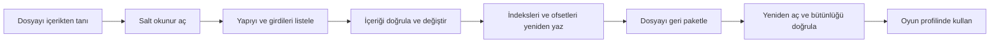
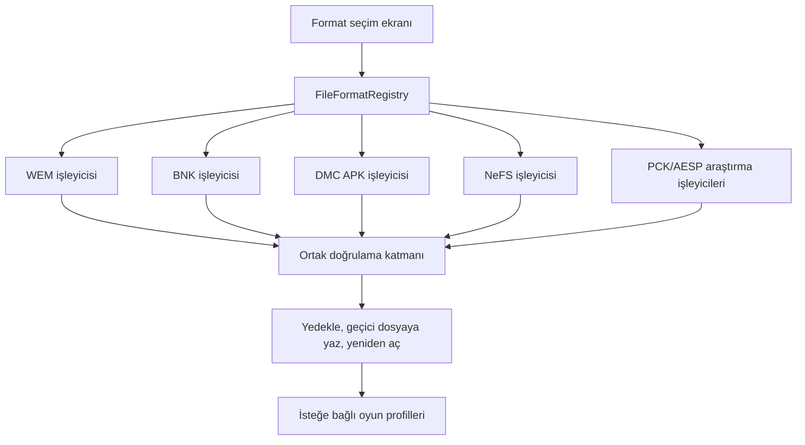

# UDMT — Dosya Formatı Laboratuvarı

**UDMT**, oyun ses ve arşiv dosyalarını güvenli biçimde tanımak, açmak, incelemek, değiştirmek ve yeniden paketlemek için geliştirilen format merkezli bir Windows masaüstü aracıdır.

> **Geliştirme durumu:** `0.3.0-beta.1`  
> **Platform:** Windows x64  
> **Teknoloji:** C# · .NET 9 · WPF  
> **Dil:** Uygulama, belgeler, commit mesajları, issue’lar ve pull request’ler Türkçedir.

## Yeni geliştirme yönü

UDMT artık ilk aşamada “her oyun için çalışan evrensel bir modlama aracı” olmaya çalışmayacaktır. Önce her dosya formatının yaşam döngüsü bağımsız olarak çözülecektir:



Oyun profilleri daha sonra eklenecek ince bir yapılandırma katmanıdır. Format kodunu kopyalamazlar:

- Outlast ve Whistleblower → doğrulanmış BNK + WEM çekirdeği
- DMC: Devil May Cry → doğrulanmış DMC APK + WEM çekirdeği
- F1 25 ve uyumlu EGO oyunları → doğrulanmış NeFS + WEM çekirdeği

Ayrıntılı görevler ve tamamlanma ölçütleri için [YOL_HARITASI.md](YOL_HARITASI.md) belgesine bakın.

## Test uygulamasında bulunan formatlar

| Format | Uzantı | İlk hedef | Mevcut ekran kapsamı |
|---|---|---|---|
| **Wwise Encoded Media** | `.wem` | Wwise kullanan oyunlar | Codec/sürüm/örnekleme/CUE tanımı ve işlem adımları |
| **Wwise SoundBank** | `.bnk` | Outlast, Whistleblower | BKHD/DIDX/DATA/HIRC yapısı ve geri paketleme planı |
| **DMC APK Arşivi** | `.apk` | DMC: Devil May Cry | DMC’ye özel indeks ve arşiv yaşam döngüsü |
| **EGO NeFS Arşivi** | `.nfs` | F1 25 ve EGO oyunları | Sürüm, sıkıştırma, çıkarma ve güvenli kayıt planı |
| **Wwise Package** | `.pck` | Wwise paketleri | Araştırma ve salt okunur açma planı |
| **Audio Event System Package** | `.aesp` | AESP kullanan oyunlar | Araştırma ve olay/medya bağlantısı planı |

> [!IMPORTANT]
> DMC için kullanılan `.apk`, Android uygulama paketi değildir. DMC: Devil May Cry’a ait özel arşiv biçimidir.

> [!NOTE]
> Mevcut BNK çalışması öncelikle **Outlast** ve **Outlast: Whistleblower** dosyalarına göre geliştirilecektir. Diğer oyunların BNK varyantları ayrıca doğrulanmalıdır.

## Uygulama akışı

1. Uygulama açıldığında oyun yerine dosya formatı seçilir.
2. Seçilen formatın bilinen kullanım alanları gösterilir.
3. Formatın uzantıdan bağımsız olarak nasıl tanınacağı açıklanır.
4. Tanıma, açma, değiştirme ve geri paketleme adımları ayrı kartlar hâlinde gösterilir.
5. Her adımın mevcut geliştirme durumu görüntülenir.
6. Format çekirdeği tamamlandıkça gerçek dosya açma ve kaydetme işlevleri aynı ekrana bağlanır.

## Koyu mod

Koyu mod varsayılan temadır. Uygulamadaki tema düğmesiyle açık ve koyu görünüm arasında anında geçiş yapılabilir.

Tema seçimi şu dosyada saklanır:

```text
%LocalAppData%\UDMT\tema.txt
```

Uygulama yeniden açıldığında son seçilen tema geri yüklenir. Pencere, panel, metin, çizgi, vurgu ve uyarı renkleri dinamik kaynaklardan yönetilir.

## Format desteğinin “tamamlandı” sayılması

Bir format yalnızca dosyayı listeleyebildiği için desteklenmiş sayılmaz. Aşağıdaki kapıların tamamı geçilmelidir:

1. İçerik tabanlı format ve varyant tespiti
2. Salt okunur açma
3. Güvenli dışa aktarma
4. Girdi ve bağımlılık doğrulaması
5. Uyumlu içerik değiştirme
6. İndeks/ofset/boyut/sıkıştırma bilgilerinin yeniden üretilmesi
7. Çıktının aynı ayrıştırıcıyla yeniden açılması
8. Otomatik yapısal testler
9. Gerçek oyun testi

## Yakın dönem geliştirme sırası

1. Depo, lisans ve test örneği temizliği
2. `IFileFormatHandler` ve içerik tabanlı format tespiti
3. WEM salt okunur açma ve metadata doğrulaması
4. Outlast/Whistleblower BNK açma ve yeniden paketleme
5. DMC APK indeks çözümleme ve güvenli yeniden paketleme
6. NeFS güvenli yazma, yedekleme ve yeniden açma doğrulaması
7. PCK ve AESP salt okunur araştırma desteği
8. Ortak otomatik test, fuzz testi, atomik kayıt ve geri alma
9. Format çekirdeklerinden sonra oyun profilleri
10. Uyumluluk matrisi ve ilk kararlı sürüm

## Teknik mimari hedefi



Önerilen ortak arabirim:

```csharp
public interface IFileFormatHandler
{
    string Id { get; }
    FormatProbeResult Probe(Stream stream);
    FormatDocument OpenRead(Stream stream);
    ValidationResult Validate(FormatDocument document);
    void Save(FormatDocument document, Stream destination);
}
```

## Mevcut sınırlar

- İndirilebilir beta şu an format seçimi, format açıklamaları, işlem planı ve tema sistemini test ettirir.
- Gerçek WEM/BNK/APK/NeFS/PCK/AESP açma ve yeniden paketleme çekirdeği bu test uygulamasına henüz bağlanmamıştır.
- Ana kaynak arşivinin ve üçüncü taraf ikili bağımlılıkların eksiksiz aktarımı tamamlanmamıştır.
- Üçüncü taraf lisans ve NOTICE belgeleri doğrulanmadan kararlı dağıtım yapılmamalıdır.
- PCK ve AESP desteği araştırma aşamasındadır.

## Çalıştırma

1. Son test sürümünün Windows x64 ZIP paketini indirin.
2. ZIP’i boş bir klasöre tamamen çıkarın.
3. `UDMT.exe` dosyasını çalıştırın.
4. İncelemek istediğiniz formatı seçin.
5. Tema düğmesiyle koyu veya açık görünümü deneyin.

Paket self-contained olarak yayımlanır.

## Veri güvenliği

Gerçek yazma desteği eklendiğinde tüm işlemler şu kurallara uyacaktır:

- Özgün dosyanın zaman damgalı yedeği oluşturulur.
- Yazma işlemi önce geçici dosyada yapılır.
- Çıktı yeniden açılıp doğrulanır.
- Başarısız dönüşüm veya doğrulamada özgün dosya değiştirilmez.
- Kullanıcıya değişiklik özeti gösterilmeden kayıt yapılmaz.

## Hukuki not

UDMT bağımsız bir topluluk projesidir. Audiokinetic, Red Barrels, Capcom, Ninja Theory, Codemasters, Electronic Arts veya adı geçen diğer hak sahipleriyle bağlantılı ya da onlar tarafından onaylanmış değildir. Kullanıcılar sahip oldukları oyun kopyaları, oyunların lisansları ve yürürlükteki mevzuat çerçevesinde hareket etmekten sorumludur.

## Belgelendirme dili

Kullanıcı arayüzü, README, yol haritası, commit mesajları, issue’lar, pull request’ler, inceleme yorumları, sürüm notları ve kullanıcıya gösterilen tüm iletiler Türkçe hazırlanır.
